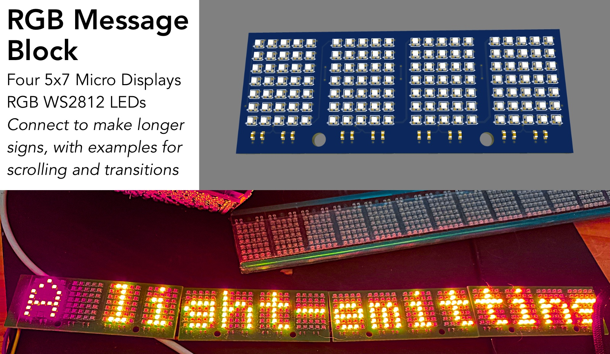

# RGB Message Block

- **Smart Home Notifications:** Display alerts or status updates from Home Assistant or other automation platforms.
- **Information Displays:** Show time, weather, or custom messages in offices, shops, or at events.
- **Creative Projects:** Add eye-catching text and animations to art installations, cosplay, or DIY electronics.

## Overview

The **RGB Message Block** is a modular, chainable 5x7 RGB LED sign based on WS2812 LEDs. Each block displays four characters (20 LEDs wide, 7 LEDs tall) and measures just 60x24mm, making it perfect for compact, customizable displays. Multiple blocks can be connected together to create longer messages or larger displays.

## Features

- **Scrolling Text:** The firmware displays scrolling messages across the LED matrix, supporting smooth transitions and effects.
- **Animated Transitions:** Enjoy visually appealing transitions between messages, including fades and color effects.
- **Modular Design:** Each block supports four characters. Chain multiple blocks to expand your display.
- **Home Assistant Integration:** Use the RGB Message Block for notifications, alerts, or status displays in your smart home setup.
- **Custom Animations:** The firmware includes built-in animations and color effects for creative displays.
- **Compact Size:** Each module is only 60x24mm, making it easy to fit into various projects.

## Firmware Description

The provided firmware is designed to:

- Drive the WS2812 LED matrix in a 5x7 layout per character.
- Scroll text messages smoothly across the display, with customizable speed and direction.
- Animate transitions between different messages or stories, including color fades and wipes.
- Support multiple stories or message sets, cycling through them automatically.
- Allow easy expansion by chaining additional blocks for longer messages.

## Getting Started

1. **Assemble your RGB Message Block(s)** and connect them in series for longer displays.
2. **Flash the firmware** to your microcontroller (ESP32 recommended).
3. **Power up the device** and enjoy scrolling messages and animations out of the box.
4. **Customize the firmware** to display your own messages, integrate with smart home systems, or create new effects.

For more details on wiring, customization, and advanced features, see the [docs](./docs/) or the source code in `src/main.cpp`.

